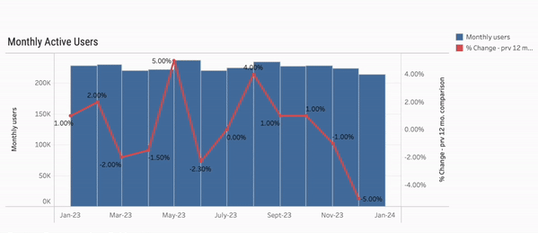
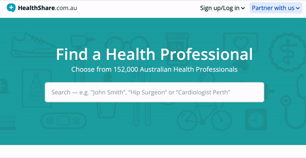

### Hi there 👋 I'm Simone

I enjoy uncovering insights from data and translating that into meaningful analyses for companies to assist with decision-making. I strongly believe data needs to tell a clear story - and to do that, you need robust insights and curious mind. On the visualisation side, I'm passionate about UX and implementing thougthful and practical features that harnesses products' full potential

My go-to tools are:
* Google's Data Studio, Power BI or Tableau for data viz
* Python for all things automation, Power-Automate if I'm feeling cheeky
* Jira & Confluence for project management and docs

## Some of my project portfolio includes:

### Gathering insights and building informative visualisations
* Preparing and visualising data for ongoing monitoring purposes. Complete end-to-end build from multiple existing datasets, into concise tables for use in self-serve dashboards as well as drill-down capabilities
  * The below image is a replica using non-real sample data, built solely for demonstration due to data confidentiality

### Data preparation and incorporation; back-end 
* Implementation of ingesting new data into production. Working with Engineering team to implement intended feature of 'Offers HICAPS' flag on website
  * Importing, matching and homogenising data via python in order to display on-site prompts

### Development in Python to build and implement internal data lineage tool
* E2E development, discovery and roll-out of internal data lineage tool to assist with data tracing, impact assessment - Assisting hugely with data transparency and clarifying complex code for the wider team
  * The below image is a replica using non-real sample data, built solely for demonstration due to data confidentiality

